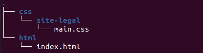

# CSS

## O que é CSS ?

- É uma folha de estilos, usada para decorar um site e torná-lo "bonito".

## Como linkar o CSS no HTML ?

- Dentro da tag `<head></head>` nós seguimos o seguinte padrão:
  - `<link rel="stylesheet" href="caminho do arquivo css">`

## Como sabemos o caminho de um arquivo até outro?

- Para "linkar"/juntar um arquivo `.html` com um `.css`, portanto a estrutura do HTML com os estilos do CSS, é necessário entendermos a forma de navegar entre pastas e arquivos.

- Pastas: onde guardamos arquivos.
- Arquivos: Onde colocamos dados, por exemplo, um `arquivo.html` onde colocamos "código" html.
 
  
  
- Para juntarmos o arquivo `index.html` ao `main.css` precisamos colocar dentro do index.html o seguinte trecho: `<link rel="stylesheet" href="./../css/site-legal/main.css">`.
  - Explicações:
    - `.`, indica a pasta atual.
    - `..`, indica a pasta anterior.
    - `/`, utilizamos para entrar em uma pasta, por exemplo: `/css` --> entra na pasta css
    - Como ficaria esse caminho: `./../css/site-legal/main.css` em portugues?
    - pasta-atual/pasta-anterior/pasta-css/pasta-site-legal/arquivo-main.css

## Qual a estrutura de um arquivo CSS?

  <br>
  - `seletor { propriedade: valor; } `

## Alguns tipos de seletores CSS:

- Para referenciar uma tag HTML: `nome-da-tagHTML { estilos }`
- Para referenciar uma classe: `.nome-da-classe { estilos }` --> utilizamos o `.` junto ao nome da classe.
  - Vale ressaltar que o nome da classe é atribuido no HTML: `<p class="nome-da-classe">paragrafo</p>`
  - Exemplo: `.nome-da-classe { estilos }`
- Para referenciar um id: `#nome-do-id { estilos }` --> utilizamos o `#` colado com o nome do id.
  - Vale ressaltar que o nome do id é atribuido no HTML: `<p id="nome-do-id">paragrafo</p>`
  - Exemplo: `#nome-do-id { estilos }`

## Aviso: Alguns seletores são mais "importantes" que os outros, as regras obedecidas serão do seletor mais "forte". Portanto tome cuidado e pesquise no Google qual os seletores que vêm antes dos outros. ( Além disso, é importante ressaltar que podemos combinar vários seletores diferentes no mesmo elemento )

- Combinando seletores: `<p id="nome-do-id" class="nome-da-classe">um texto aqui</p>`
  - `.nome-da-classe { estilos }`
  - `#nome-do-id { estilos }` --> prioridade em cima da classe
  - `#nome-do-id .nome-da-classe { estilos }` --> juntando os dois seletores, maior prioridade

# Algumas propriedades e valores no CSS

## Mudar a cor de um texto

- ```
  seletor {
    color: red; // nome da cor em inglês --> podemos pesquisar as cores no Google em inglês
  }
  ```
- ```
  seletor {
    color: #ff0000; // hexadecimal --> podemos pesquisar as cores no Google em hexadecimal
  }
  ```
- ```
  seletor {
    color: rgb(255, 0, 0); // rgb da cor --> podemos pesquisar as cores no Google em rgb
  }
  ```

## Como mudar a cor de fundo de alguma tag HTML ?

- ```
    seletor {
      background-color: red; // muda a cor de fundo da tag selecionada para vermelho
    }
  ```

## Como mudar a fonte do texto HTML de um _container_?

- ```
    seletor {
      font-size: 12px; // coloca a fonte com tamanho de 12px --> px, ou pixels, é uma das formas mais usadas para medir as coisas digitalmente, em sites e muitas outras coisas.

      color: red; // deixa a cor do texto vermelha como ja foi mencionado

      font-weight: bold; // deixa o texto em negrito

      // temos inúmeras outras propriedades, para isso basta você ler o livro da oficina.
    }
  ```

## Margin e Padding: espaçamentos

- A margem é um _espaçamento por fora_ de um elemento, geralmente o espaço entre um elemento e outro é feito com uma margin:

  - ```
    seletor {
      margin: 20px;
      // aplica 20px de espaçamento *externo* no *topo* do elemento selecionado
      // aplica 20px de espaçamento *externo* na *direita* do elemento selecionado
      // aplica 20px de espaçamento *externo* em *baixo* do elemento selecionado
      // aplica 20px de espaçamento *externo* na *esquerda* do elemento selecionado
    }
    ```

- Já o padding é um _preenchimento interno_, entre o elemento em si e o seu conteudo. Por exemplo, o espaço entre o texto dentro de um container, e as bordas do mesmo.
- ```
  seletor {
    padding: 20px;
    // aplica 20px de espaçamento *interno* no *topo* do elemento selecionado
    // aplica 20px de espaçamento *interno* na *direita* do elemento selecionado
    // aplica 20px de espaçamento *interno* em *baixo* do elemento selecionado
    // aplica 20px de espaçamento *interno* na *esquerda* do elemento selecionado
  }
  ```

````

## Display flex: Posicionamento do conteúdo na tela ( `display: flex;` para inserir esse posicionamento no CSS )

- Basicamente com o display flex nos podemos posicionar elementos HTML na tela como quisermos.
- Quando colocamos display flex em um container, os filhos desse container irão ficar um do lado do outro, ao invés de um em baixo do outro.

  - Por que isso ocorre?

  - ```
    seletor {
      display: flex; // deixa os elementos um ao lado do outro
      flex-direction: row; // essa propriedade é um padrão do navegador, portanto quando colocamos um display flex
      // automaticamente já temos um *flex-direction: row;* que significa "em linha"
      // fazendo com que os elementos fiquem "lado a lado"
      // se quisermos que os elementos fiquem um acima do outro basta colocarmos:

      flex-direction: column; // que significa, "em coluna", um acima do outro
    }
    ```

- Como centralizar elementos com display-flex?

  - ```
    seletor {
      display: flex;
      justify-content: center;
      // posiciona os elementos HTML filhos desse seletor ao centro da tela
      // vale ressaltar que a propriedade justify-content leva em consideração o eixo principal
      // portanto, se temos uma flex-direction: row; os elementos serão centralizados na horizontal --> eixo X

      align-items: center; // centraliza os elementos HTML filhos desse seletor no centro da tela
      // o align-items leva em consideração o eixo secundário, portanto se temos um eixo
      // principal: flex-direction: row; ( horizontal ), com o *align-items: center;* iremos alinhar ao centro na vertical
    }
    ```
````
