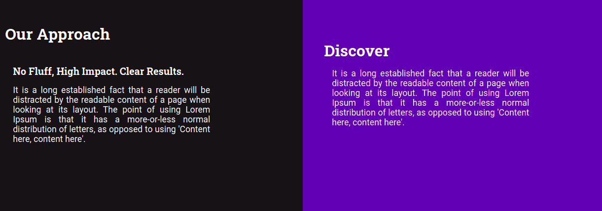
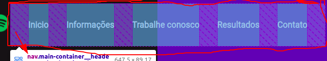

# HTML

## O que é HTML?
- É uma linguagem de marcação de texto, basicamente um documento de texto.

## O que são _tags_ HTML?
- São estruturas que tem uma marca de início e uma de fim, as quais tem diferentes comportamentos, e são usadas no HTML para todas ações.

## Quais as principais _tags_ do HTML?
 - `<html></html>` ( o HTML inteiro )
 - `<head></head>` ( onde ficam as configurações da página HTML )
 - `<body></body>` ( onde fica o conteúdo do html, o que vemos na página )
 - Percebemos que todas essas _tags_ tem um padrão, no qual ela começa com `<nome da tag>` e termina com `</nome da tag>`
 - Algumas _tags_ fecham em si mesmas, sem necessitar de outras partes, que é o caso da _tag_ para adicionar imagens: `` ( não é necessário lembrar disso por enquanto )

## O que são atributos das _tags_ HTML?
 - São propriedades dentro das _tags_ que recebem valores
 - Colocamos valores dentro das aspas: `""`. Cada atributo e cada _tag_ tem seu funcionamento, para entender cada um podemos simplesmente pesquisar no Google: "o que o atributo `nome do atributo` da tag `nome da tag` faz ?
    - Exemplo de tag com atributo:
    ``

## O que é o "caminho" dos arquivos?
 - O que deve ser percorrido para chegar neles, isso será melhor detalhado nas aulas síncronas, no entanto, você pode verificar nesse video: https://www.youtube.com/watch?v=9p5E69VQoxY

## O que é um _container_ em HTML?
 - É uma espécie de limitação onde colocamos conteúdo dentro, por exemplo, uma caixa onde colocamos coisas. Um exemplo de _container_ genérico ( sem significado específico ) é uma `

`
 - Ao contrário da _div_, alguns outros _containers_ têm significado. Normalmente buscamos utilizar as _tags_ com os significados adequados para cada caso, no entanto, isso não é obrigatório.

 ### Vale ressaltar que sempre utilizamos um _container_ dentro de outro _container_, pois eles servem basicamente para demarcar espaços.

## Alguns _containers_ muito utilizados no HTML são:
 - `<header></header>` ( é a parte de cima de um container, normalmente utilizado para a parte de cima de uma página )
    - Exemplo de um `header`:
      
      

 - `<main></main>` ( onde fica o conteúdo principal da página )
    - Exemplo de um `main`:
      
      

 - `<nav></nav>` ( utilizamos para colocar um menu de navegação do site - colocar links que levam para outras páginas ); dentro do _header_ temos uma navegação, e em volta desses links de navegação temos uma `nav`.
    - Exemplo de uma `nav`: ( para mostrar melhor, utilizei a função de inspecionar do Google Chrome - irei comentar sobre ao percorrer da oficina ) 
      
      

 - `

` ( como já comentado, _div_ é um _container_ sem significado algum, muito utilizado )
    - O _div_ não irá ter um exemplo, pois podemos utilizar div para literalmente qualquer coisa.

## Como "colocar" textos no HTML?
 - Para **exclusivamente mostrar textos em tela** temos algumas _tags_, as mais comuns sendo:
  - `
Olá sou um parágrafo no HTML
` ( os parágrafos são blocos de textos que ficam em uma única linha )

  - `<h1>Olá sou um título principal no HTML</h1>` ( também pode ser usado para destacar o conteúdo mais importante da página, normalmente temos 1 `h1` por página )

  - `<h2></h2>` - `<h3></h3>` - `<h4></h4>` ( temos alguns números, quanto maior, "menos importante", mas é importante utilizar `tipos de titulos` diferentes para cada texto e não utilizar apenas `h1` e `h2` para tudo )

  - `` ( são as "âncoras" ou "links", basicamente nos fazem navegar de uma página a outra e tem um atributo chamado `href` no qual o valor é a página que queremos ir ao clicar nele )
      - Exemplo de navegação com âncoras ``:
        
        

  - `Também sem significado, normalmente usado para colocar um estilo em um único trecho de texto` ( o span é legal de ser utilizado juntamente com as classes CSS, o que verão mais a frente )
