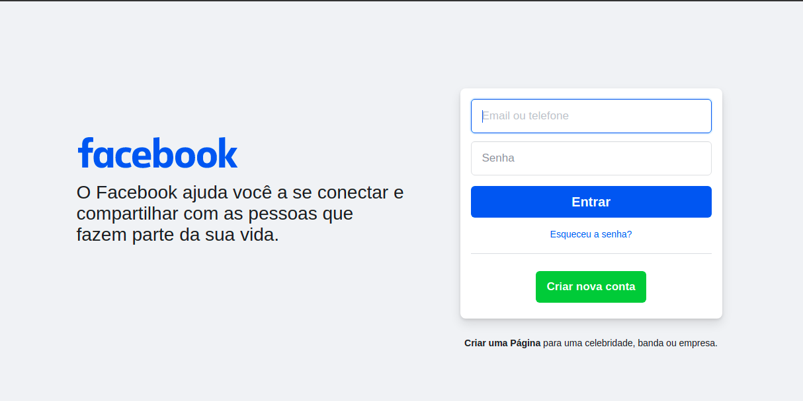

# Conceitos básicos

## O que é _Front-end_?

- Em resumo é a parte visual de uma aplicação, tudo aquilo que conseguimos ver na tela.
- Por exemplo, uma parte do _front-end_ do Facebook:
  
  

## O que utilizamos para desenvolver o _front-end_ de um site na web?

- O _browser_ consegue entender basicamente, **HTML, CSS E JAVASCRIPT**
- O **HTML** cria o "corpo" das páginas, como se fosse o esqueleto. Ele é todo e qualquer texto, além dos _containers_.
- O **CSS** estiliza esse corpo, ele dá uma aparência agradável ao HTML que está no site.
- O **JavaScript** torna o site dinâmico, por exemplo quando entramos em um site que realiza cálculos, uma calculadora, basicamente o código JavaScript resolve esses cálculos. Ou quando clicamos em um menu e ele expande para baixo, também foi o JavaScript.

## Podemos utilizar essas 3 tecnologias juntas:

- Isso é muito comum e muito utilizado, levando em consideração que uma tecnologia complementa a outra.

## No _front-end_ temos a responsividade que significa:

- O _layout_, isto é, a visualização da página, se adequar a todos tamanhos de tela. Desde um computador com uma tela enorme até um celular. Tudo isso é feito utilizando CSS, porque ele que cuida da estilização dos sites.

-------------------------------------------------------------------------

## O que é _Back-end_?

- Em resumo é a "parte de trás" da aplicação, a parte que está no servidor. Portanto o _back-end_ participa do processo de cadastrar usuários e guardar os mesmos em um banco de dados, excluir usuários, entre outras coisas. O _back-end_, diferente do _front-end_, precisa ser muito bem protegido.

## Para que serve o _Back-end_?

- Quando precisamos "esconder" algo do usuário, por ser uma informação confidencial, ou para não poluir a tela com código, precisamos de um _back-end_. Portanto, nem todos sites tem um _back-end_, pois nem sempre é necessário.

## Exemplo de utilidade do back-end:

- Se precisamos realizar um login, por exemplo, como sabemos se o usuário é ele mesmo?
  - É necessário que ele envie **e-mail** e **senha** corretos.
  - Onde sabemos se esses dados, e-mail e senha, estão corretos? No _back-end_, pois não podemos guardar essas informações no _front-end_. Senão, qualquer usuário teria acesso.

## Com isso concluímos que:

- O _front-end_ e o _back-end_ normalmente são vistos juntos em uma aplicação. No entanto, nem sempre é necessário ter os dois, muitas aplicações não têm um _back-end_.
